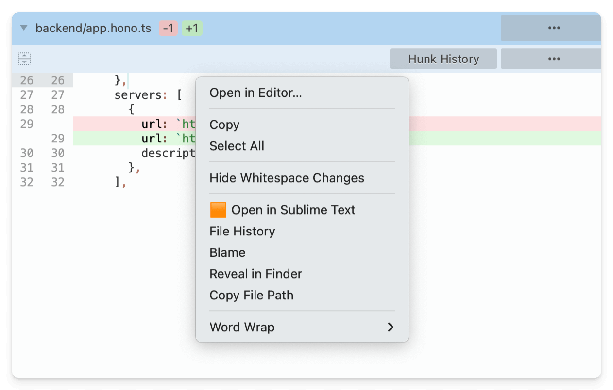

# Sublime Merge with github, gitlab, bitbucket, azure integration

Sublime Merge open in GitHub/GitLab/Bitbucket/Azure Integration command & menu item


Based on research  [Original source](https://forum.sublimetext.com/t/github-gitlab-bitbucket-integration-commands-menu-items/53893)
by [@srbs](https://github.com/srbs)

## Install macOS

1. Download zip repository and unarchive

1. Open terminal in folder and run

```sh
sh alias
```

1. Copy `User` folder to 

```
~/Library/Application Support/Sublime Merge/Packages
```

1. done :)

## Features

### Open in Sublime Text

Useful for quickly opening diff context files in [Sublime Text](https://www.sublimetext.com/docs/command_line.html) when you need to fast edit with not main editor.

Additional features:
- File History
- Blame
- Reveal in Finder
- Copy File Path





## Changelog

**23.04.2025**
- add File History, Blame, Reveal in Finder, Copy File Path

**11.10.2022**
- Azure support
- single quotes for commit and branch

**18.05.2021**
- add 🔗 (chain emoji) for better visual ux


## Related

[SublimeMergeOobug](https://github.com/oobug/SublimeMergeOobug) - Python configuration for Windows

## License
MIT
