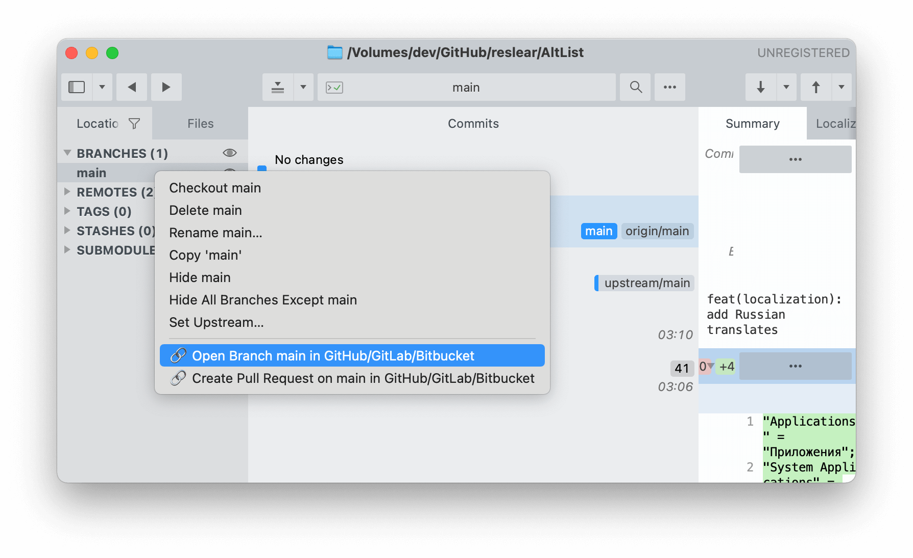

# Sublime Merge with github, gitlab, bitbucket, azure integration

Sublime Merge open in GitHub/GitLab/Bitbucket/Azure Integration command & menu item



Based on research  [Original source](https://forum.sublimetext.com/t/github-gitlab-bitbucket-integration-commands-menu-items/53893)
by [@srbs](https://github.com/srbs)

## Install macOS

1. Download zip repository and unarchive

1. Open terminal in folder and run

```sh
sh alias
```

1. Copy `User` folder to 

```
~/Library/Application Support/Sublime Merge/Packages
```

1. done :)

## Changes

**11.10.2022**
- Azure support
- single quotes for commit and branch

**18.05.2021**
- add 🔗 (chain emoji) for better visual ux


## Related

[SublimeMergeOobug](https://github.com/oobug/SublimeMergeOobug) - Python configuration for Windows

## License
MIT
